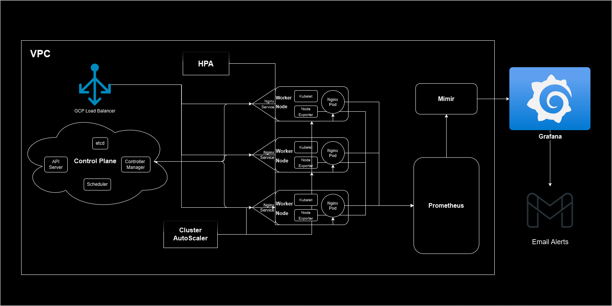

# Architecture Documentation for Automated Kubernetes Cluster Deployment

## Overview
This project focuses on deploying a highly available, autoscaling Kubernetes cluster on Google Kubernetes Engine (GKE) using Terraform. The cluster is designed to provide robust monitoring and autoscaling capabilities, ensuring optimized performance and resilience for hosted applications. This document outlines the architecture of the deployment, covering cluster configuration, monitoring setup, and autoscaling mechanisms.

## Table of Contents
1. [Cluster Architecture](#cluster-architecture)
2. [Autoscaling Strategy](#autoscaling-strategy)
3. [Monitoring and Alerting](#monitoring-and-alerting)
4. [Infrastructure Components](#infrastructure-components)
5. [High-Level Diagram](#high-level-diagram)

---

## 1. Cluster Architecture
### Cluster Type
- **Provider**: Google Cloud Platform (GCP)
- **Service**: Google Kubernetes Engine (GKE)
- **Cluster Type**: Zonal (single-zone deployment)
- **Region**: `me-west1` with a managed node pool
- **Node Configuration**: 
  - **Machine Type**: `n2-standard-4`
  - **Node Pool**: Autoscaling enabled, with a minimum of 1 node and a maximum of 5 nodes, to accommodate dynamic workload demands.

### Workloads
The primary workload deployed to this cluster is an **nginx web server** serving as a demonstration application. This simple yet effective setup allows for easy monitoring of resource utilization and autoscaling responses.

### Tools & Technologies Used
- **Terraform**: Manages the GKE cluster and associated infrastructure components (e.g., VPC, subnets, IAM roles).
- **Helm**: Used to deploy and manage Kubernetes packages, including Prometheus and Grafana Mimir.
- **Kubernetes Autoscaling Tools**:
  - **Horizontal Pod Autoscaler (HPA)**: Scales pods based on CPU/memory utilization.
  - **Cluster Autoscaler**: Adjusts the number of worker nodes in response to resource demands across the cluster.

---

## 2. Autoscaling Strategy
The autoscaling configuration supports both pod-level and cluster-level scaling to maintain performance under varying load.

### Horizontal Pod Autoscaler (HPA)
- **Purpose**: Automatically adjusts the number of pod replicas based on CPU and memory utilization.
- **Thresholds**: Configured to scale up pods when CPU usage exceeds 10%.

  *This threshold is significantly higher for production workloads.*
- **Application**: Applied to the nginx web server deployment to demonstrate pod-level autoscaling.

### Cluster Autoscaler
- **Purpose**: Adjusts the number of worker nodes in the GKE cluster based on the total resource demands, ensuring pods are scheduled without resource constraints.
- **Node Pool Autoscaling**:
  - **Minimum Nodes**: 1
  - **Maximum Nodes**: 5
  - **Trigger**: Autoscaling events occur when pending pods cannot be scheduled due to insufficient node resources.

---

## 3. Monitoring and Alerting
To maintain visibility into cluster health, resource usage, and application performance, a robust monitoring setup has been implemented.

### Prometheus
- **Deployment**: Installed via Helm to collect and  non-persistently store metrics from both the cluster and nginx application.
- **Metrics Collected**:
  - Node and pod-level metrics, including CPU, memory, disk usage, and network traffic.
  - Application-specific metrics for the nginx web server.
- **Remote Write Configuration**: Configured to send metrics to Grafana Mimir for enhanced storage and retrieval capabilities.

### Grafana Mimir & Grafana Cloud Dashboards
- **Grafana Mimir**: Acts as a centralized, high-performance data store for Prometheus metrics, enabling efficient storage and querying.
- **Grafana Dashboards**: Utilizes Grafana Cloud to visualize metrics from Mimir, providing real-time dashboards that track the four golden signals:
  - **Latency**: Measures response time of the nginx server.
  - **Traffic**: Tracks incoming requests and data throughput.
  - **Errors**: Monitors error rates at the node and application level.
  - **Saturation/Utilization**: Displays resource usage, including CPU and memory, across nodes and pods.
- **Alerting**: Configured in Grafana to trigger alerts for conditions such as high CPU/memory usage or node failures, with notifications set up via SMTP for alerting emails.

---

## 4. Infrastructure Components

### Terraform Configuration
- **VPC and Subnet Setup**: Provisioned a VPC with subnets configured to support the GKE cluster's networking requirements.
- **IAM Roles**: Configured roles to allow access to the necessary GCP resources, ensuring permissions for cluster management and monitoring.
- **Outputs**: Terraform outputs include critical information like the cluster endpoint, kubeconfig for connectivity, and node group details.

### Helm Chart Deployments
- **Prometheus and Grafana Mimir**: Deployed using Helm charts for streamlined management and updates.
- **Kubernetes Resources**: Includes deployments, services, and autoscaling configurations for nginx and monitoring tools.

---

## 5. High-Level Diagram

---

## Summary
This architecture provides a comprehensive, automated Kubernetes environment with strong monitoring and autoscaling features. The setup balances resource efficiency and resilience, making it suitable for both development and production workloads. The use of Terraform, Prometheus, and Grafana ensures that the infrastructure is reproducible, visible, and scalable according to demand.

---