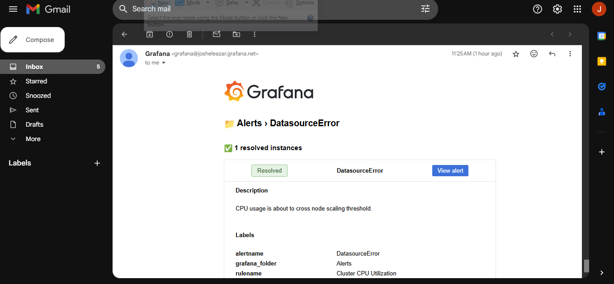
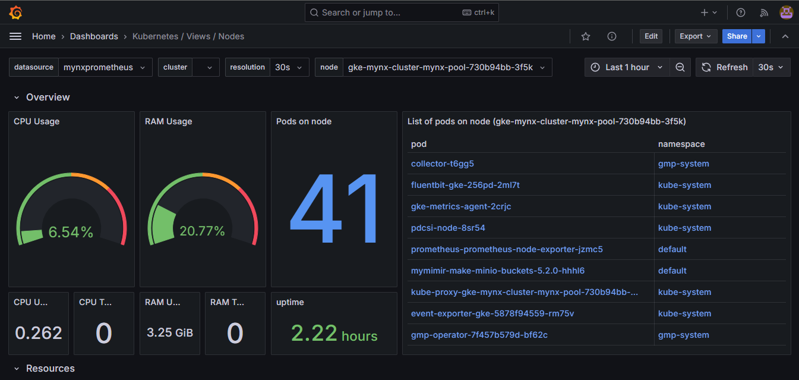
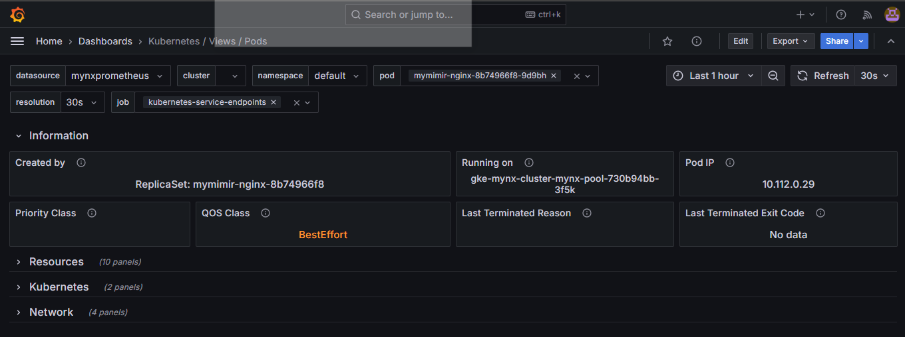
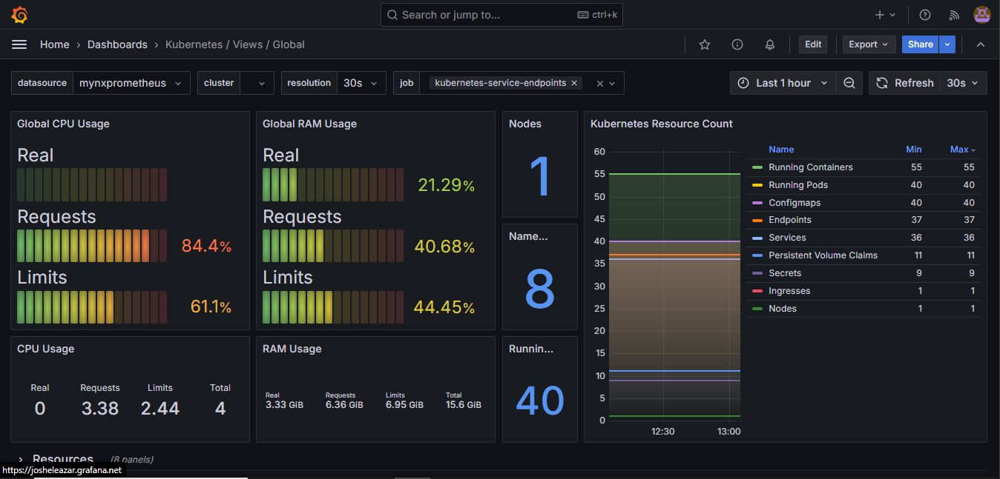
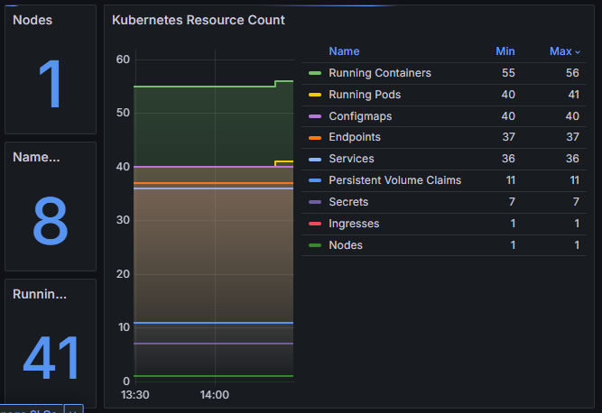
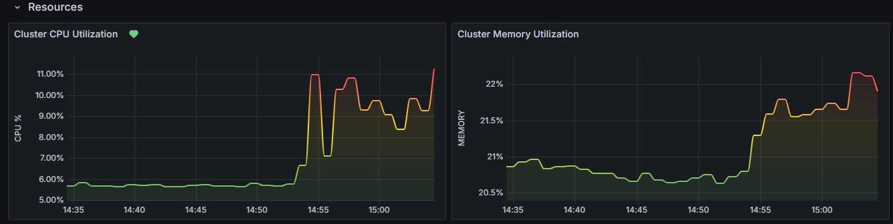
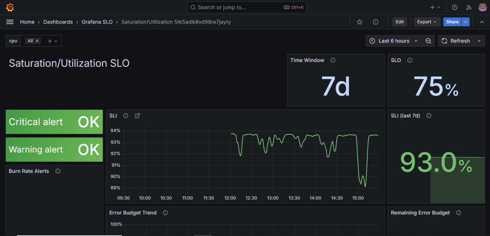

# Dashboard Documentation for Automated Kubernetes Cluster Monitoring

## Overview
This document provides an overview of the Grafana dashboards used to monitor the Kubernetes cluster on GKE. The dashboards cover cluster health, resource utilization, and scaling behavior. Due to limited application-level data from the open-source nginx setup, dashboards monitoring specific application metrics (e.g., latency, traffic, errors, and saturation) contain placeholder data. However, cluster-level metrics are accurately monitored.

## Table of Contents
1. [Alerting Setup](#alerting-setup)
2. [Cluster Resource Utilization Dashboard](#cluster-resource-utilization-dashboard)
3. [Global Resource Count Dashboard](#global-resource-count-dashboard)
4. [Filler Metrics Disclaimer](#filler-metrics-disclaimer)

---

## 1. Alerting Setup
### Overview
While there is no dedicated alerts dashboard, Grafana’s alerting feature is enabled, with alert notifications successfully tested via email. Alerts can be configured on any dashboard panel, providing flexibility to monitor critical conditions across different metrics. Alerts are set up to notify on thresholds such as high CPU or memory usage, and custom conditions can be defined for various panels.

### Alert Configuration
- **Alerting Capabilities**:
  - Alerts can be set for multiple conditions, including CPU, memory, and network utilization.
  - Custom thresholds and conditions can be specified for each alert, enabling granular monitoring of resource health.
- **Notification**: Tested via SMTP to Gmail, alert notifications are delivered through email, ensuring prompt notification of critical events.

### Email Screenshot
A screenshot of an alert email is included in the project documentation to demonstrate the functionality of the alerting system.

---

## 2. Cluster Resource Utilization Dashboard
### Purpose
This dashboard provides a comprehensive view of cluster-level CPU and memory usage, tracking these resources both at the node and pod levels. This dashboard is critical for evaluating overall cluster health and identifying high-resource-consuming workloads.

### Key Panels
- **Node-Level Resource Utilization**:
  - **CPU Usage**: Shows CPU usage across all nodes.
  - **Memory Usage**: Visualizes memory utilization per node.

- **Pod-Level Resource Utilization**:
  - **CPU and Memory per Pod**: Lists resource usage for each pod, providing insight into pod-level demands.

### Accurate Data Representation
Metrics shown in these dashboards accurately reflect cluster-level data, providing real-time insights into node and pod resource utilization.

---

## 3. Global Resource Count Dashboard
### Purpose
The Global Resource Count Dashboard provides a high-level overview of the total number of active resources within the cluster, including node and pod counts. This dashboard graphically visualizes scaling events, showing how resource counts adjust in response to changing workloads.

### Key Panels
  - **Nodes**. Nodes are deployed on high-performance n2-standard-4 GCE servers, optimized to support the resource-intensive Grafana Mimir. This robust setup allows the cluster to manage substantial workloads before requiring scaling adjustments.
  - **Resource Count**: Displays the total number of k8s resources across the cluster, providing visual insight into Horizontal Pod Autoscaler (HPA) activity in real-time.

    A simple load test from a local machine demonstrated scaling behavior by triggering the addition of one extra pod. To achieve this, the CPU utilization threshold was temporarily lowered for proof of concept.

### Visual Snapshots Before and After Increased Load
 These panels provide some insight into the dynamic adjustments of node and pod counts as load increases.
 
**Before load simulation**

**After load simulation**

---

## 4. Filler Metrics Disclaimer
Due to the open-source nginx setup, application-level metrics specific to the four golden signals—**Latency**, **Traffic**, **Errors**, and **Saturation/Utilization**—are unavailable. As a result, dashboards intended to track these signals contain placeholder metrics, which do not reflect actual nginx-specific data. All other cluster-level metrics, however, are accurate and provide real-time insights.

This is a snapshot of the Utilization SLO dashboard.

---

## Summary
These Grafana dashboards provide essential monitoring capabilities, allowing visibility into cluster health, resource utilization, and autoscaling events. The alerting setup, tested and demonstrated via email, supports the monitoring of custom-defined conditions across dashboards, ensuring that critical events are promptly addressed.